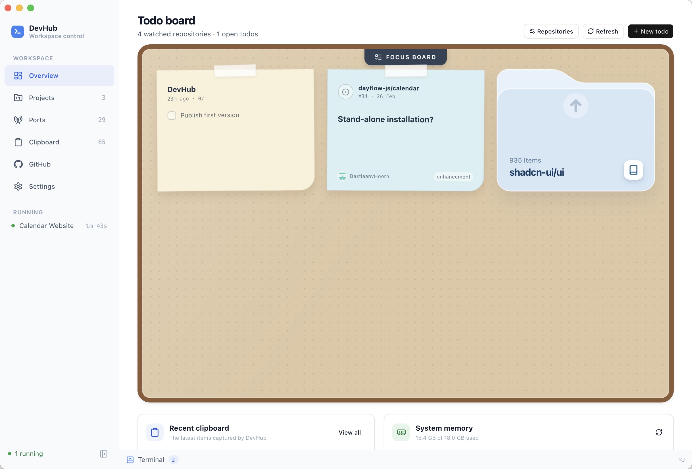
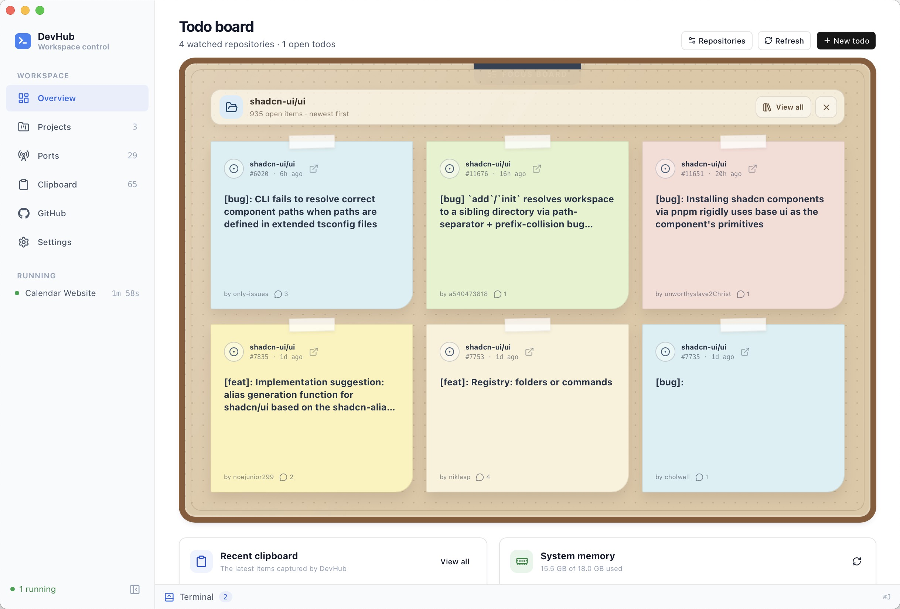
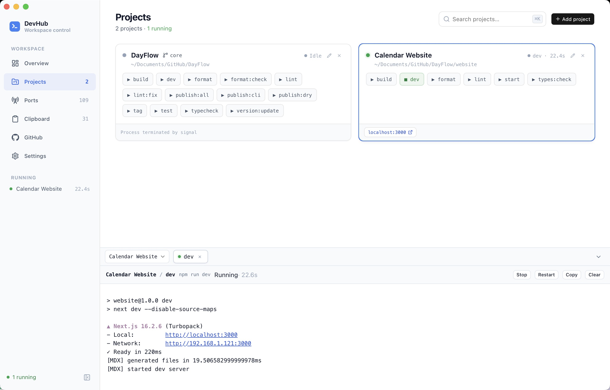
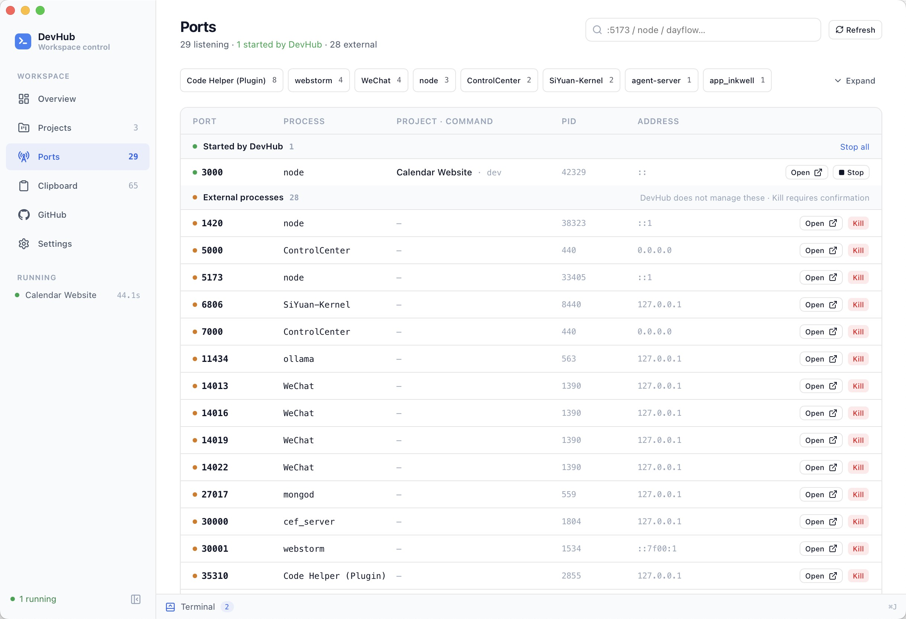
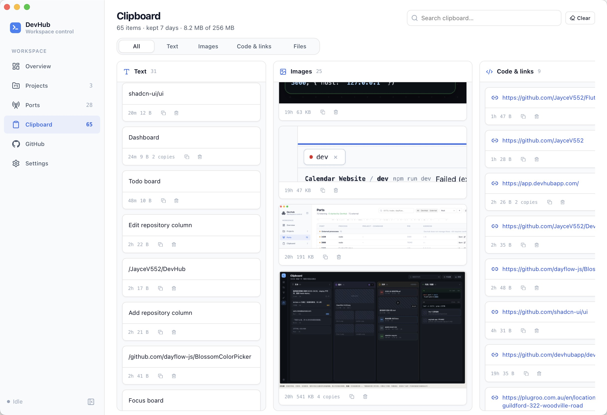
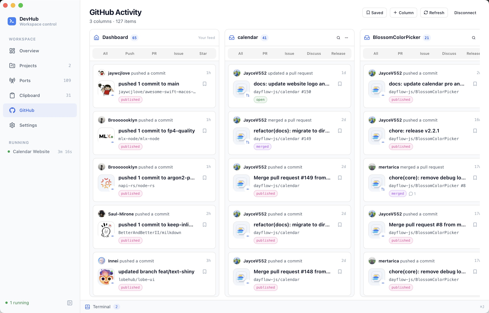

<p align="center">
  
</p>

<h1 align="center">DevHub</h1>

<p align="center">
  A desktop control center for local development.
  Run projects, inspect ports, follow logs, manage clipboard history, and keep up with GitHub activity in one place.
</p>

<p align="center">
  <a href="LICENSE"></a>
  
  
</p>

## Why DevHub?

DevHub answers a simple question: **what is happening in my local development environment right now?**

Add a project and run scripts detected from `package.json` or `Cargo.toml`.<br>
Start, stop, and restart commands while viewing live ANSI colored output.<br>
See every listening TCP port and which project or process owns it.<br>
Search and reuse clipboard history across text, images, files, code, and links.<br>
Follow pull requests, issues, discussions, releases, and pushes in a customizable GitHub board.<br>
Keep personal todos beside repository issues in a focused Todo Board.<br>
Group projects into workspaces and recover processes left behind after an unexpected exit.

## Screenshots

### Todo Board

Keep personal tasks and GitHub issues together on a focused pinboard.



### Issue Folder

Open a repository folder to browse its latest issues without leaving the board.



### Projects

Run project commands and follow their output.



### Ports

Find listening ports and identify the project or process that owns each one.



### Clipboard

Search clipboard history across text, images, files, code, and links.



### GitHub Activity

Organize repository activity into focused and customizable columns.



## Getting started

### Requirements

Node.js 20+<br>
[pnpm](https://pnpm.io/)<br>
Rust 1.95+<br>
The [Tauri 2 system prerequisites](https://v2.tauri.app/start/prerequisites/) for your platform

### Run locally

```bash
git clone https://github.com/JayceV552/DevHub.git
cd DevHub
pnpm install
pnpm app
```

Build a native application bundle with:

```bash
pnpm app:build
```

## GitHub access

Connect from **Settings** with GitHub's device flow or a personal access token. DevHub only reads activity data; credentials are stored in the operating system keychain.

## Development

```bash
pnpm typecheck
cd src-tauri && cargo test
```

The frontend uses React, TypeScript, and Tailwind CSS. The desktop backend is built with Tauri and Rust.

See the [roadmap](ROADMAP.md) for planned work.

## License

DevHub is licensed under the [GNU Affero General Public License v3.0](LICENSE).
